# Crossing the Border

Papers Please!

```mermaid {scale: 0.575}
sequenceDiagram
    Citizen ->> Border Agent: Let me pass!
    Border Agent -->> Citizen: 🚫 Papers Please!
    Citizen ->> Border Agent: Let me pass with Passport
    Border Agent ->> Administration: Verify Passport
    Note right of Administration: Is the passport expired?
    Note right of Administration: Are stamp/watermark valid?
    Administration -->> Border Agent: ✔️
    Border Agent -->> Citizen: ✔️ Welcome!
    Administration -->> Border Agent: 🚫
    Border Agent -->> Citizen: 🚫 Go Awai!
```

---
level: 2
title: Authentication & Authorization
layout: image-large
image: ../public/police-1.webp
---

# Authentication/Authorization

Verify token validity and grant access

```mermaid {scale: 0.575}
sequenceDiagram
    Client ->> Server: Request Resource
    Server -->> Client: 🚫 401 Unauthorized
    Client ->> Server: Request Resource with Token
    Server ->> Auth Provider: Verify Token
    Note right of Auth Provider: Is the token expired?
    Note right of Auth Provider: Is the signature valid?
    Auth Provider -->> Server: ✔️
    Server -->> Client: ✔️ 200 OK
    Auth Provider -->> Server: 🚫
    Server -->> Client: 🚫 403 Forbidden
```

