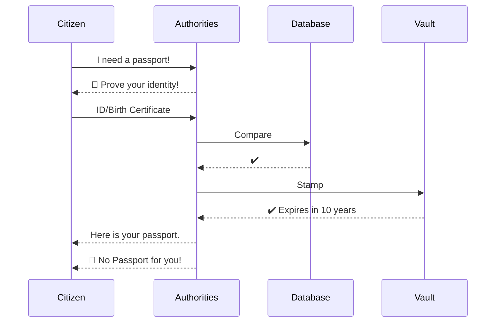
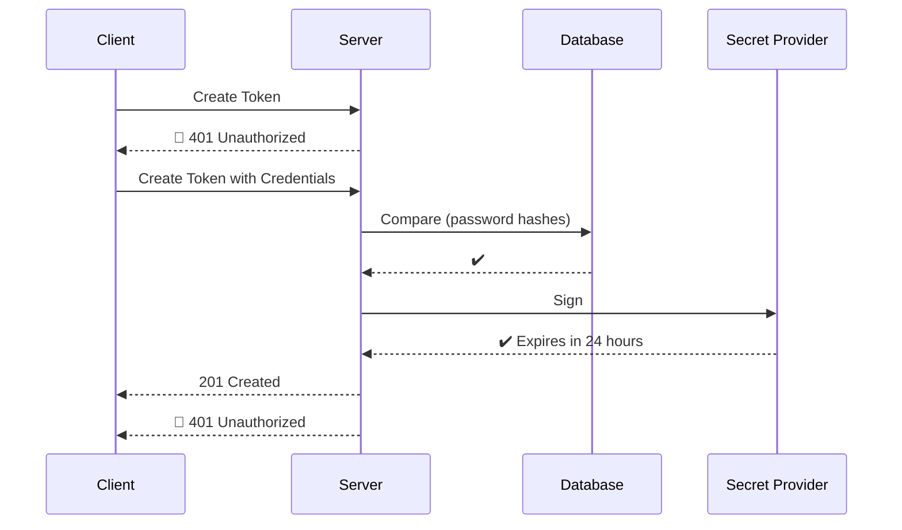

# Issue a Passport

How do we get the passport?

```mermaid {scale: 0.6}
sequenceDiagram
    Citizen ->> Authorities: I need a passport!
    Authorities -->> Citizen: 🚫 Prove your identity!
    Citizen ->> Authorities: ID/Birth Certificate
    Authorities ->> Database: Compare
    Database -->> Authorities: ✔️
    Authorities ->> Vault: Stamp
    Vault -->> Authorities: ✔️ Expires in 10 years
    Authorities -->> Citizen: Here is your passport.
    Authorities -->> Citizen: 🚫 No Passport for you!
```

---
level: 2
layout: image-large
image: ../public/stamp-1.webp
---

# Issue a Token

How do we get the token?

```mermaid {scale: 0.6}
sequenceDiagram
    Client ->> Server: Create Token
    Server -->> Client: 🚫 401 Unauthorized
    Client ->> Server: Create Token with Credentials
    Server ->> Database: Compare (password hashes)
    Database -->> Server: ✔️
    Server ->> Secret Provider: Sign
    Secret Provider -->> Server: ✔️ Expires in 24 hours
    Server -->> Client: 201 Created
    Server -->> Client: 🚫 401 Unauthorized
```

