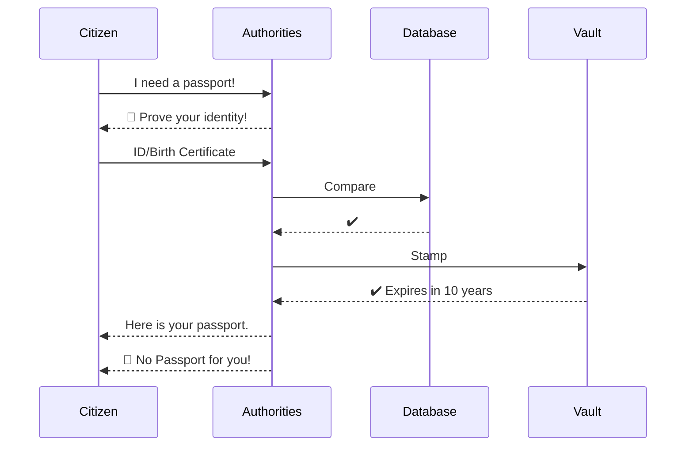

# Runtime

"Laufzeitsicht"

System flow and behavior at runtime.

```mermaid {scale: 0.55}
sequenceDiagram
    Citizen ->> Authorities: I need a passport!
    Authorities -->> Citizen: 🚫 Prove your identity!
    Citizen ->> Authorities: ID/Birth Certificate
    Authorities ->> Database: Compare
    Database -->> Authorities: ✔️
    Authorities ->> Vault: Stamp
    Vault -->> Authorities: ✔️ Expires in 10 years
    Authorities -->> Citizen: Here is your passport.
    Authorities -->> Citizen: 🚫 No Passport for you!
```
